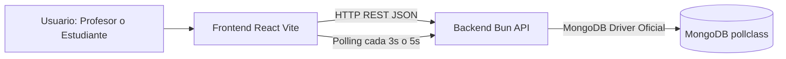
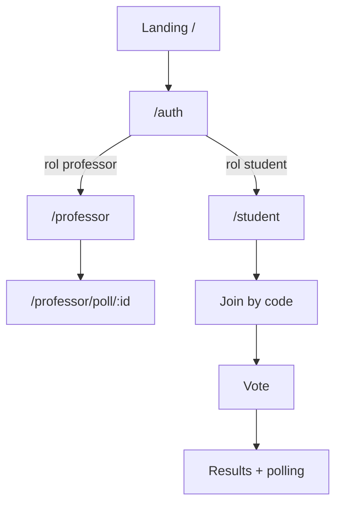
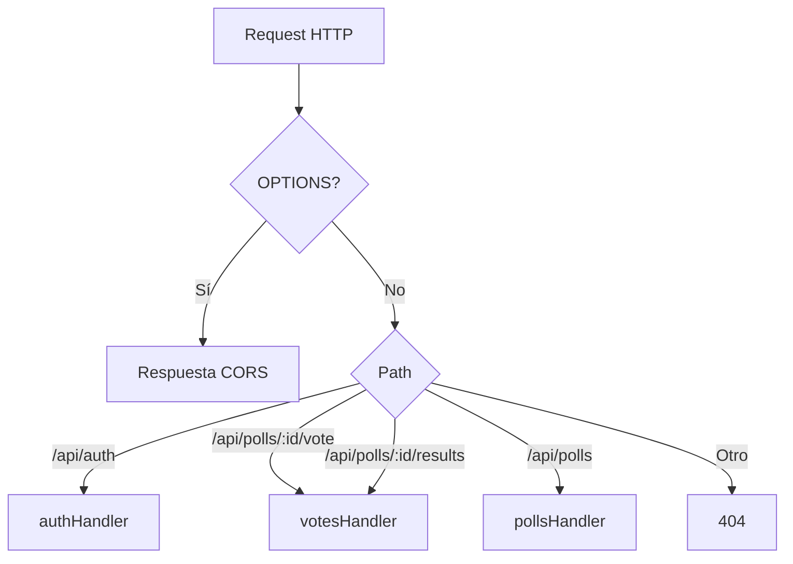
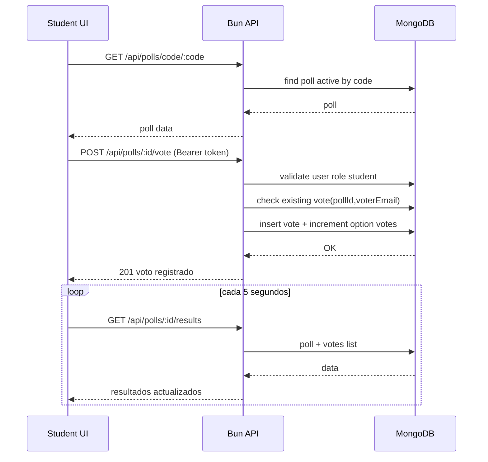
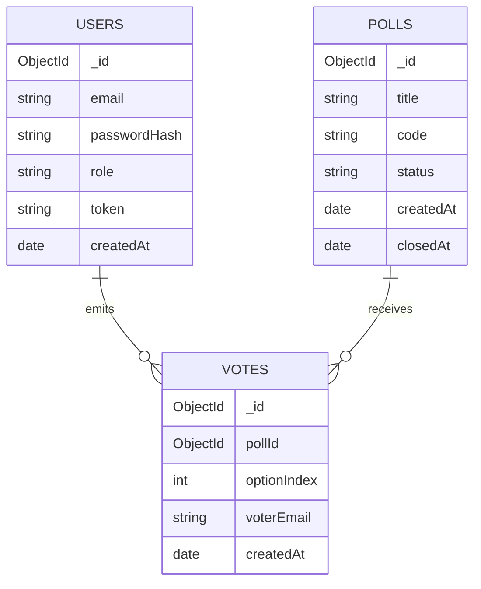

# Documentación Técnica - LAB1DS9 (PollClass)

## 1. Resumen Ejecutivo

LAB1DS9 es una aplicación web full stack para encuestas en vivo en aula, compuesta por:

- Frontend en React + Vite + Tailwind (carpeta client)
- Backend en Bun con enrutamiento HTTP nativo (carpeta server)
- Persistencia en MongoDB usando el driver oficial mongodb

El sistema soporta dos roles:

- Profesor: crea, cierra y elimina encuestas; visualiza resultados en tiempo real
- Estudiante: se une por código y vota una sola vez por encuesta

La actualización en vivo de resultados no usa WebSockets; usa polling HTTP desde el frontend.

## 2. Cómo fue creado (reconstrucción técnica)

Por la estructura del repositorio y los archivos de especificación, el proyecto se construyó como monorepo simple con dos aplicaciones desacopladas:

- client para UI (Vite)
- server para API (Bun)

Se observa una evolución desde una idea inicial documentada (PRD) hacia una implementación más directa:

- PRD plantea Mongoose/Hono como opciones
- Código implementado usa Bun.serve + router manual + MongoDB driver oficial (sin ORM)

La orquestación local se hace con scripts de raíz, pero actualmente se ejecuta en dos terminales (cliente y servidor por separado).

## 3. Arquitectura General



### 3.1 Capas

- Presentación: páginas y componentes React
- Aplicación/API: handlers auth, polls, votes en servidor Bun
- Datos: colecciones users, polls, votes en MongoDB

### 3.2 Principios de diseño observados

- Backend sin framework pesado (mínima abstracción)
- Autenticación stateless mediante token Bearer persistido en BD
- Reglas de negocio críticas en servidor (rol, voto único, encuesta activa)

## 4. Estructura del Proyecto

```text
LAB1DS9/
  client/
    src/
      components/
      context/
      pages/
      services/
  server/
    config/
    middleware/
    routes/
  .env
  .env.example
  README.md
  PollClass-PRD.md
```

## 5. Frontend (client)

## 5.1 Ruteo de UI

- /: Landing
- /auth: login/registro
- /professor: panel profesor
- /professor/poll/:id: resultados de una encuesta
- /student: flujo estudiante (unirse, votar, ver resultados)



## 5.2 Servicios frontend

- services/api.js: cliente HTTP común con token automático en Authorization
- services/auth.js: login, registro, logout y persistencia de sesión
- Contexto global: AuthContext con estado de usuario

## 5.3 Estado y persistencia en navegador

Se guarda en localStorage:

- pollclass_token
- pollclass_user

## 6. Backend (server)

## 6.1 Entry point y enrutamiento

El servidor usa Bun.serve y distribuye por prefijo de ruta:

- /api/auth -> authHandler
- /api/polls/*/vote y /api/polls/*/results -> votesHandler
- /api/polls -> pollsHandler



## 6.2 Autenticación y autorización

- Registro y login en auth.ts
- Token aleatorio UUID por usuario
- Header esperado: Authorization: Bearer <token>
- Middleware getUserFromRequest busca usuario por token
- Control de permisos por rol:
  - Professor: crear/cerrar/eliminar encuestas
  - Student: votar

## 6.3 Reglas de negocio clave

- Código de encuesta de 6 caracteres alfanuméricos único
- Voto único por encuesta y estudiante (pollId + voterEmail)
- No se puede votar en encuesta cerrada

## 7. Comunicación entre servicios

## 7.1 API REST principal

Auth:

- POST /api/auth/register
- POST /api/auth/login
- GET /api/auth/me

Polls:

- GET /api/polls
- POST /api/polls
- GET /api/polls/:id
- GET /api/polls/code/:code
- PATCH /api/polls/:id/close
- DELETE /api/polls/:id

Votes:

- POST /api/polls/:id/vote
- GET /api/polls/:id/results

## 7.2 Flujo de voto (secuencia)



## 8. Base de Datos

## 8.1 Motor y ubicación

- Motor: MongoDB
- Base usada: pollclass
- URI actual en entorno local: mongodb://127.0.0.1:27017/pollclass

Conclusión: sí, en este proyecto la BD está configurada para ejecutarse localmente en la máquina de desarrollo, salvo que se cambie MONGODB_URI a un servidor remoto (por ejemplo Atlas).

Importante sobre ubicación física de archivos:

- Los datos no se guardan dentro de este repositorio.
- MongoDB escribe en su propio directorio de datos del servicio instalado en Windows.
- Esa ruta depende de cómo se instaló MongoDB (servicio MSI, Docker, configuración manual), por lo que no está definida en este código fuente.

## 8.2 Estructura de colecciones

### users

Campos observados:

- _id: ObjectId
- email: string (único)
- passwordHash: string
- role: professor | student
- token: string UUID
- createdAt: Date

Índice:

- unique(email)

### polls

Campos observados:

- _id: ObjectId
- title: string
- options: array de objetos { text: string, votes: number }
- code: string (6 chars, único)
- status: active | closed
- createdAt: Date
- closedAt: Date (opcional)

Índice:

- unique(code)

### votes

Campos observados:

- _id: ObjectId
- pollId: ObjectId
- optionIndex: number
- voterEmail: string
- createdAt: Date

Índice:

- unique(pollId, voterEmail)

## 8.3 Diagrama entidad-relación lógico



## 9. Variables de entorno

Variables usadas por la implementación actual:

- PORT
- MONGODB_URI
- MONGODB_DB (opcional; default pollclass)
- VITE_API_BASE (frontend)

## 10. Ejecución local

Servidor:

- bun run dev (dentro de server)

Cliente:

- bun run dev (dentro de client)

Puertos por defecto:

- Frontend: 5173
- Backend: 3001
- MongoDB local: 27017

## 11. Observaciones técnicas relevantes

- El login no rota token en cada sesión (reusa token existente si ya estaba)
- Al eliminar una encuesta, no se eliminan explícitamente sus votos en el handler actual
- La lectura de resultados no exige auth explícita en backend; cualquier cliente con pollId puede consultar
- CORS abierto con origen *

Estas observaciones no impiden operar localmente, pero son importantes para endurecimiento en producción.

## 12. Referencias de implementación

- Frontend principal: client/src/App.jsx
- Contexto de autenticación: client/src/context/AuthContext.jsx
- Cliente API: client/src/services/api.js
- Entry point backend: server/index.ts
- Conexión MongoDB: server/config/db.ts
- Auth routes: server/routes/auth.ts
- Poll routes: server/routes/polls.ts
- Vote routes: server/routes/votes.ts
- Configuración local actual: .env
